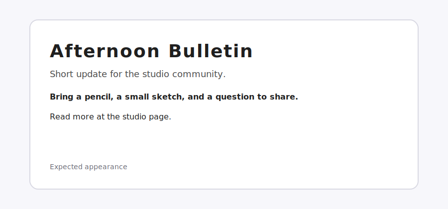

# Lesson 5

## Goal
Fix the text styling so the page looks polished and readable.

## Before You Start
1. Open `lesson-05/index.html` in your browser (or use the Live Server preview in VS Code)
2. Look at the **Expected appearance** image below
3. Compare what you see to the image—what text styling is wrong or missing?
4. Open the Developer Tools (F12) and inspect the HTML
5. Check if the stylesheet is connected in the `<head>`
6. Then start debugging!

## Expected appearance

## Hints
- Make sure the stylesheet is connected in the `head`.
- Missing semicolons can break multiple rules.
- Watch for typos in CSS property names and values (especially text decoration).

## Task
1. Open the lesson-05 index.html file.
2. Find and fix the styling problems.
3. Make sure the text styles apply as intended.

## Rubric (5 points)
- **1 pt** - Stylesheet is properly connected
- **2 pts** - Found and fixed CSS errors
- **2 pts** - Text styling displays correctly
