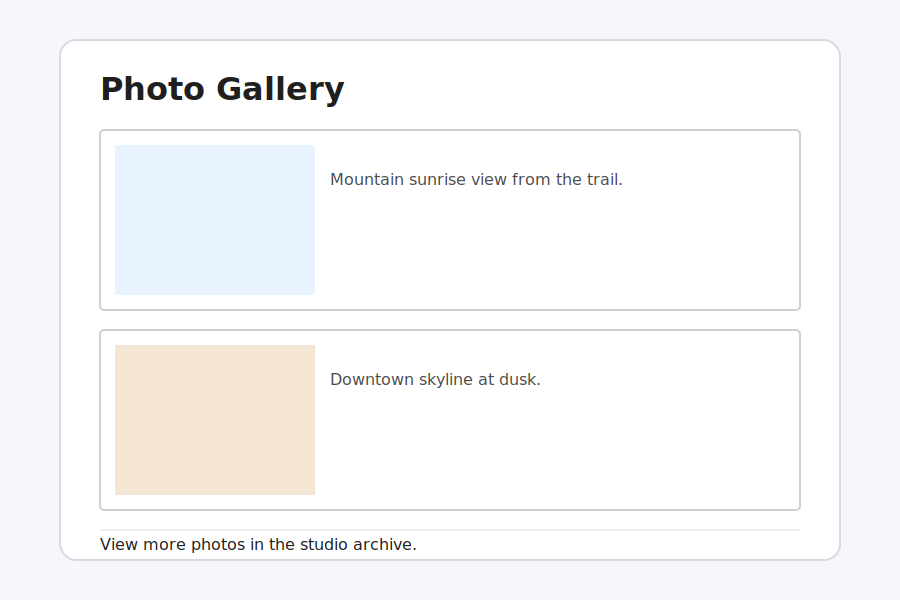

# Lesson 6

## Goal
Fix the layout styles so images and text are properly spaced with borders.

## Before You Start
1. Open `lesson-06/index.html` in your browser (or use the Live Server preview in VS Code)
2. Look at the **Expected appearance** image below
3. Compare what you see to the image—what's different about spacing, borders, or layout?
4. List 3-4 specific differences
5. Then start debugging!

## Expected appearance

## Hints
- Missing semicolons can break CSS rules.
- Check border, margin, padding, and float properties.
- Make sure the stylesheet is linked in the HTML.

## Task
1. Open the lesson-06 index.html file.
2. Find and fix the styling problems.
3. Make sure the layout matches the expected output.

## Rubric (8 points)
- **1 pt** - Stylesheet is properly linked
- **2 pts** - Found and fixed CSS errors
- **1 pt** - CSS is properly formatted and indented
- **3 pts** - Layout and spacing are correct
- **1 pt** - Layout matches expected output
